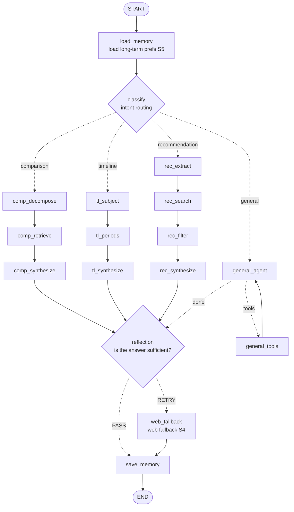

# 🎨 ArtAgent — Western Art Intelligent Agent

<p align="right"><a href="README.md">中文</a> · <a href="README.en.md">English</a></p>

> A painter / art-history agent built on the SemArt dataset, demonstrating the four core agent capabilities: **planning, tool use, memory, and reflection**.

ArtAgent is an assistant that understands Western art history. It goes beyond "retrieve + fill a template" — it **decides the task type, decomposes the problem itself, generates its own retrieval strategy, reflects on answer quality, and remembers your preferences across sessions**. It uses a **hybrid architecture**: structured tasks run through explicit orchestration pipelines (every decision step is visible), while open-ended questions fall back to a ReAct tool loop (flexible and autonomous).

---

## ✨ Core Capabilities (5 Scenarios)

| Scenario | Example Prompt | Highlight |
|---|---|---|
| **① Cross-dimension style comparison** | "Compare Monet and Van Gogh in their use of color" | Organized dimension by dimension (color/brushwork/mood), not a flat list |
| **② Timeline + image evidence** | "Trace Turner's stylistic evolution" | Narrative across periods, each period illustrated with a representative work |
| **③ Preference-based chained recommendation** ⭐ | "I love Van Gogh's bold, expressive style — who else would I like?" | **The retrieval query is a style profile the agent *reasons out*, not the user's literal words** |
| **④ Knowledge-gap web fallback** | Auto web-search when the dataset can't answer | Reflection judges "insufficient info" → triggers web search and re-answers |
| **⑤ Cross-session long-term memory** | "Recommend another painter" | Remembers your liked painters/styles, personalizes across sessions |

> **Scenario ③ is the one worth highlighting**: the user says "bold and expressive," and the agent first reasons out a structured style profile like `"bold vivid color contrasts, thick impasto brushwork, high emotional intensity..."`, then uses *that* for vector retrieval to match other painters — a direct demonstration of "understand → reason → retrieve," not keyword matching.

---

## 🏗️ Architecture

### Hybrid orchestration: explicit pipelines + ReAct fallback

> The diagram below is exported from the actual compiled graph via `graph.get_graph().draw_mermaid()` and renders natively on GitHub.



<details>
<summary>Branch responsibilities (click to expand)</summary>

- **comparison** (S①): `decompose` splits subjects & dimensions → `retrieve` per subject → `synthesize` organizes the comparison dimension by dimension
- **timeline** (S②): `subject` extracts the topic → `periods` groups evidence by era + attaches images → `synthesize` builds the narrative
- **recommendation** (S③): `extract` reasons out a style profile → `search` retrieves by profile (excluding already-liked painters) → `filter` for relevance → `synthesize` recommends only in-list painters
- **general**: ReAct tool loop, `agent ⇄ tools` autonomously decides which tools to call and how many times
- **reflection → web_fallback**: if reflection finds the info insufficient and no retry has happened yet, it triggers a web-backed re-answer (S④)

</details>

**Why a hybrid architecture?**
- Pure ReAct: planning/reflection are hidden inside the LLM — invisible and hard to control, tough to demo or debug.
- Pure explicit graph: too rigid for open-ended questions.
- **Hybrid**: when the task shape is known (comparison/timeline/recommendation) use explicit pipelines where every planning, retrieval, and reflection node is visible; hand open questions to ReAct for flexibility. You get both demonstrable orchestration and adaptability.

### Tech Stack

| Module | Choice |
|---|---|
| Agent orchestration | LangGraph (multi-branch StateGraph + MemorySaver for multi-turn memory) |
| LLM | DeepSeek / Qwen (OpenAI-compatible endpoint, swappable) |
| Vision model | Qwen-Omni (`qwen3.5-omni-plus`, image analysis) |
| Vector store | Chroma (local persistent, 21,382 vectors) |
| Embedding | BGE `bge-small-en-v1.5` |
| Long-term memory | SQLite (standard library, no extra dependency) |
| Dataset | SemArt (21,384 European paintings, 8th–19th c., with art-commentary text) |
| Web search | Tavily (optional, degrades gracefully when unset) |
| Web UI | Gradio |

---

## 🧰 Tools

The agent can autonomously call these 7 tools in the `general` branch; explicit pipelines call them internally as needed:

| Tool | Purpose |
|---|---|
| `semantic_search` | Semantic vector retrieval (fuzzy topic/style/description queries) |
| `exact_lookup` | Structured exact lookup (by artist/title/date/school) |
| `query_painter_knowledge` | Painter biography/style/status Q&A (dataset stats + LLM knowledge) |
| `compare_artwork_styles` | Structured style comparison of two artworks |
| `analyze_image` | Vision-model analysis of a painting (composition/color/brushwork) |
| `image_lookup` | Locate representative works from the local image library (no vision analysis) |
| `web_search` | Web fallback search (when local can't answer) |

---

## 📁 Project Structure

```
ArtAgent/
├── app.py                      # Gradio web UI (three-column layout)
├── requirements.txt
├── .env                        # API key & path config
├── scripts/
│   └── build_index.py          # one-time Chroma index builder
├── src/
│   ├── agent/
│   │   ├── graph.py            # hybrid graph core (intent routing + 4 branches + reflection fallback)
│   │   ├── state.py            # AgentState (shared state across all branches)
│   │   ├── prompts.py          # prompts for every node
│   │   └── nodes/
│   │       ├── common.py       # routing/memory/reflection/web-fallback + helpers
│   │       ├── comparison.py   # S① comparison pipeline
│   │       ├── timeline.py     # S② timeline pipeline
│   │       ├── recommendation.py # S③ recommendation pipeline (key highlight)
│   │       └── general.py      # ReAct tool-loop branch
│   ├── tools/                  # 7 tool implementations
│   ├── memory/
│   │   └── store.py            # SQLite long-term preference store (S⑤)
│   ├── data/
│   │   └── loader.py           # SemArt loading/cleaning
│   └── utils/
│       └── llm.py              # LLM client wrapper
├── tests/                      # tool tests, multi-turn, multi-tool, four-branch smoke tests
├── SemArt/                     # dataset (CSV + Images/)
└── data/index/chroma/          # prebuilt vector index
```

---

## 🚀 Quick Start

### 1. Install dependencies

```bash
pip install -r requirements.txt
```

> Developed and verified on Python 3.11.

### 2. Configure `.env`

```ini
# LLM (OpenAI-compatible endpoint, example uses Qwen)
DEEPSEEK_API_KEY=your-api-key
DEEPSEEK_BASE_URL=https://dashscope.aliyuncs.com/compatible-mode/v1
DEEPSEEK_MODEL=deepseek-v3

SEMART_DATA_DIR=./SemArt
INDEX_DIR=./data/index

# S④ web fallback (optional; degrades gracefully if unset)
# TAVILY_API_KEY=tvly-xxxxxxxx
```

### 3. Build the vector index (first run; skip if `data/index/chroma/` already exists)

```bash
python scripts/build_index.py
```

First run takes ~5–10 min (downloads the embedding model + vectorizes ~21k rows); loads in seconds afterward.

### 4. Launch the web UI

```bash
python app.py
```

Open `http://localhost:7860` in your browser to chat.

---

## 🧪 Tests

```bash
python tests/test_tools.py       # 4 tool unit tests
python tests/test_pipelines.py   # four-branch end-to-end smoke (comparison/recommendation/timeline/general + memory)
python tests/test_multi_turn.py  # multi-turn conversation memory
python tests/test_multi_tool.py  # multi-tool chained calls
```

---

## 🔍 Observability

A multi-step agent fires several LLM calls per turn; without logs you can't answer "which branch ran / how many docs retrieved / reflection verdict / which node was slow." Every node emits structured logs + latency (see [`docs/sample_trace.md`](docs/sample_trace.md) for real traces):

```
[classify] query=compare Monet and Van Gogh's color intent=comparison
[decompose] subjects=['Claude Monet', 'Vincent van Gogh'] dimensions=['color use', 'brushwork']
[retrieve] hits_per_subject={'Claude Monet': 4, 'Vincent van Gogh': 4}
[comp_retrieve] done in 15687ms → comparison_retrieve   ← bottleneck at a glance
[reflection] verdict=PASS answer_len=1105
```

```bash
ARTAGENT_LOG_LEVEL=DEBUG ARTAGENT_LOG_FILE=run.log python app.py
```

## 📊 Evaluation

Not just "it runs" — quantifiable, reproducible metrics (see [`eval/`](eval/README.md)):

| Metric | Result | Method |
|---|---|---|
| **Intent classification accuracy** | **96.0%** (Macro-F1 0.962) | 50 hand-labeled queries (10+ boundary cases), run against the real `classify_intent` node |
| **Known-item retrieval Recall@5** | **64.0%** | Random artworks queried by a description snippet; check if the source painting lands in top-5 (auto-labeled, fixed seed, reproducible) |

```bash
python eval/run_eval.py                 # run everything
python eval/run_eval.py --no-retrieval  # intent only (no vector DB, faster)
```

The label set deliberately includes ambiguous cases (e.g. "recommend a book about Rembrandt" — contains "recommend" but is really a knowledge question), keeping accuracy in a believable range rather than a suspicious 100%. Both misclassifications are explainable general→recommendation boundary cases triggered by preference keywords.

## 💡 Design Trade-offs & Known Limits

- **Data coverage**: SemArt only covers 8th–19th-century European painting — **no 20th-century painters such as Picasso**. A single painter typically spans only 1–2 fifty-year periods, so single-painter timelines are thin — the timeline scenario states its coverage honestly and supplements with the LLM's art-history knowledge.
- **Reflection cost**: every branch ends with one reflection LLM call (an extra round-trip per turn), in exchange for making the reflection capability visible and demonstrable. In production this could fire only when an answer looks insufficient.
- **Chinese-name translation**: SemArt stores English only, so the agent translates Chinese painter/artwork names to English before retrieval (a common-name table is built into the prompt).
- **Web fallback**: with no `TAVILY_API_KEY` set it doesn't error — it degrades to local + model-knowledge answers.
- **Encoding**: the SemArt CSV is latin-1 encoded (handled correctly by the loader); the Windows console is GBK, so printing Chinese/accented characters in the terminal may look garbled, but the in-memory data and web UI display are both correct.

---

## 📚 Dataset Citation

```bibtex
@InProceedings{Garcia2018How,
  author    = {Noa Garcia and George Vogiatzis},
  title     = {How to Read Paintings: Semantic Art Understanding with Multi-Modal Retrieval},
  booktitle = {Proceedings of the European Conference in Computer Vision Workshops},
  year      = {2018},
}
```
