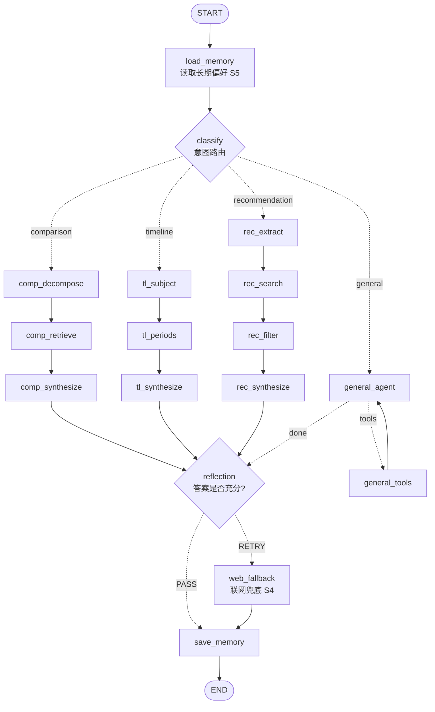

# 🎨 ArtAgent —— 西方艺术智能体

<p align="right"><a href="README.md">中文</a> · <a href="README.en.md">English</a></p>

> 基于 SemArt 数据集的画家/艺术主题 Agent，完整体现 **规划、工具调用、记忆、反思** 四大 Agent 能力。

ArtAgent 是一个懂西方艺术史的智能助手。它不只是"检索 + 套模板回答"，而是能**判断任务类型、自己拆解问题、生成检索策略、反思答案质量、跨会话记住你的偏好**。项目采用 **混合架构**：任务结构明确时走显式编排管线（可视化每一步决策），开放式问题时走 ReAct 工具循环（灵活自主）。

---

## ✨ 核心能力（5 大场景）

| 场景 | 示例提问 | 亮点 |
|---|---|---|
| **① 跨维度风格对比** | "对比莫奈和梵高在色彩运用上的差异" | 逐维度组织对比（用色/笔触/情绪），而非简单罗列 |
| **② 时间线梳理 + 配图** | "梳理透纳的风格演变" | 按时期串联叙事，每个时期配代表作品图 |
| **③ 基于偏好的链式推荐** ⭐ | "我喜欢梵高浓烈奔放的风格，还会喜欢谁？" | **检索 query 是 Agent 推理生成的风格特征，而非用户原话** |
| **④ 知识库缺口兜底** | 数据集查不到时自动联网 | 反思判定"信息不足"→ 触发 web 搜索重答 |
| **⑤ 跨会话长期记忆** | "再推荐一位画家" | 记住你喜欢的画家/风格，跨会话个性化 |

> **场景③ 是最值得讲的一环**：用户说"浓烈奔放"，Agent 先推理出 `"bold vivid color contrasts, thick impasto brushwork, high emotional intensity..."` 这样的结构化风格特征，再用它去向量检索匹配其他画家 —— 直接体现"理解 → 推理 → 检索"能力，而不是关键词匹配。

---

## 🏗️ 架构设计

### 混合编排：显式管线 + ReAct 兜底

> 下图由 `graph.get_graph().draw_mermaid()` 从真实编译图导出，GitHub 可直接渲染。



<details>
<summary>各分支职责（点击展开）</summary>

- **comparison**（场景①）：`decompose` 拆解对比对象与维度 → `retrieve` 分别检索 → `synthesize` 逐维度组织对比
- **timeline**（场景②）：`subject` 提取主题 → `periods` 按时期分组取证据 + 配图 → `synthesize` 串联叙事
- **recommendation**（场景③）：`extract` 推理风格特征 → `search` 按特征检索(排除已喜欢画家) → `filter` 相关性过滤 → `synthesize` 只推荐名单内画家
- **general**：ReAct 工具循环，`agent ⇄ tools` 自主决定调用哪些工具、调几次
- **reflection → web_fallback**：反思若判定信息不足且未重试过,触发联网重答(场景④)

</details>


**为什么用混合架构？**
- 纯 ReAct：规划/反思都藏在 LLM 内部，不可见、不可控 —— 演示和调试都难。
- 纯显式图：对开放式问题太僵硬。
- **混合**：任务结构已知（对比/时间线/推荐）时用显式管线，每个规划、检索、反思节点都看得见；开放问题交给 ReAct 灵活处理。既能展示编排能力，又保留灵活性。

### 技术栈

| 模块 | 选型 |
|---|---|
| Agent 编排 | LangGraph（StateGraph 多分支流程 + MemorySaver 多轮记忆） |
| LLM | DeepSeek / 通义千问（OpenAI 兼容 API，可切换） |
| 视觉模型 | Qwen-Omni（图像分析，API） |
| 向量库 | Chroma（本地持久化，39,314 条 core 向量） |
| Embedding | BGE `bge-m3`（文本，本地缓存后全离线；图片通道走多模态 API，额度不足时降级） |
| 精排 | Jina Reranker v3.5（API；本地兜底可切换） |
| 长期记忆 | SQLite（标准库，无额外依赖） |
| 数据集 | SemArt（21,384 幅欧洲绘画，8–19 世纪，含艺术评论文本） |
| 联网搜索 | Tavily（可选，未配置时优雅降级） |
| Web UI | FastAPI + SSE + 原生前端 |

---

## 🧰 工具（Tools）

Agent 在 `general` 分支可自主调用全部工具（意图树 tool 叶子与工具带 1:1 自动对齐）：

| 工具 | 用途 |
|---|---|
| `semantic_search` | 语义向量检索（主题/风格/描述/用户文档），支持 `filters`（author/school/timeframe/source） |
| `exact_lookup` | 结构化精确查询（按画家/标题/年代/画派） |
| `query_painter_knowledge` | 画家结构化统计（作品数/流派/时期/技法/代表作） |
| `image_lookup` | 定位配图；`analyze=True` 触发视觉模型看图分析 |
| `read_page_image` | 读取用户上传 PDF 整页图内容（视觉模型） |
| `web_search` | 联网搜索（本地查不到/时效信息时） |
| `compare_subjects` | 按对象分组收集对比证据（画家/画作/风格） |
| `timeline_by_periods` | 按年代分组轴梳理风格演变与配图 |
| `recommend_with_exclusions` | 偏好特征提炼 → 检索 → 排除已喜欢画家 |
| `color_analysis` | 本地计算：主色调/明度对比/饱和度/构图网格（免费） |
| `aggregate_stats` | 本地统计：按流派/时期/技法分组计数与占比 |
| `compare_images` | 两幅画同帧视觉对比（笔触/色彩/构图，一次视觉调用） |
| `museum_search` | Met 开放馆藏检索（CC0，免费） |
| `wiki_lookup` | 维基百科摘要（画家/流派/术语定义） |
| `remember` / `recall` / `forget` | 跨会话记忆读写删 |
| `save_collection` 等 6 项 | 收藏清单与偏好管理（增删查改） |
| `skill_*`（3 项） | 深度画作分析 / 文档总结 / 展览研究技能 |

---

## 📁 项目结构

```
ArtAgent/
├── api.py                      # FastAPI 后端（SSE 流式，主入口）
├── web/                        # 服务层：LangGraph 推理与渲染，UI 无关
│   └── service.py
├── static/                     # 自研前端：index.html + app.css + app.js + 徽标/饰线 SVG
├── requirements.txt
├── .env                        # API key、路径配置
├── scripts/
│   └── build_index.py          # 一次性构建 Chroma 向量索引
├── src/
│   ├── agent/
│   │   ├── graph.py            # 混合架构核心图（意图路由 + 4 分支 + 反思兜底）
│   │   ├── state.py            # AgentState（贯穿所有分支的公共状态）
│   │   ├── prompts.py          # 所有节点的 Prompt
│   │   └── nodes/
│   │       ├── common.py       # 路由/记忆/反思/web兜底 + 工具函数
│   │       ├── comparison.py   # 场景① 对比管线
│   │       ├── timeline.py     # 场景② 时间线管线
│   │       ├── recommendation.py # 场景③ 推荐管线（核心亮点）
│   │       └── general.py      # ReAct 工具循环分支
│   ├── tools/                  # 5 个工具实现
│   ├── memory/
│   │   └── store.py            # SQLite 长期偏好存储（场景⑤）
│   ├── data/
│   │   ├── access.py           # 数据访问层（模糊匹配/行转字典/证据格式化）
│   │   └── loader.py           # SemArt 数据加载/清洗
│   └── utils/
│       └── llm.py              # LLM 客户端封装
├── tests/                      # 工具测试、多轮对话、多工具链、四分支冒烟测试
├── SemArt/                     # 数据集（CSV + Images/）
└── data/index/chroma/          # 预构建的向量索引
```

---

## 🚀 快速开始

### 1. 环境准备

```bash
pip install -r requirements.txt
```

> 本项目在 Python 3.11 下开发验证。

### 2. 配置 `.env`

```ini
# LLM（OpenAI 兼容接口，示例为通义千问）
DEEPSEEK_API_KEY=your-api-key
DEEPSEEK_BASE_URL=https://dashscope.aliyuncs.com/compatible-mode/v1
DEEPSEEK_MODEL=deepseek-v3

SEMART_DATA_DIR=./SemArt
INDEX_DIR=./data/index

# 场景④ 联网兜底（可选，不填则优雅降级）
# TAVILY_API_KEY=tvly-xxxxxxxx
```

### 3. 构建向量索引（首次运行，若 `data/index/chroma/` 已存在可跳过）

```bash
python scripts/build_index.py
```

首次约 5–10 分钟（下载 embedding 模型 + 向量化 2.1w 条），之后秒级加载。

### 4. 启动 Web 界面

```bash
python api.py
```

浏览器打开 `http://localhost:7860` 即可对话。

> 界面为自研前端（FastAPI + SSE 流式 + 原生 HTML/CSS/JS），逐节点展示思考链、内联配图、会话持久化。

---

## 🧪 测试

测试分两层（`pytest.ini` 已配置，默认只跑快档）：

```bash
pytest                # 快档：411 个纯单测/API 集成测试（无 LLM/无网络/无模型，约 1-2 分钟）
pytest -m slow        # 慢档：真实检索冒烟（加载 bge-m3 + Jina 联网，见 tests/test_tools.py）
pytest -m "not slow or slow"   # 全量
```

慢档需要本地数据/模型与网络，默认不跑；CI 与 `scripts/regression.ps1` 均只跑快档。
老式脚本入口（`python tests/test_xxx.py`）仍可用，适合单文件调试。

---

## 🔍 可观测性

多步 Agent 每轮要发多次 LLM 调用,没有日志就无法回答"走了哪个分支 / 检索到几条 / 反思结论 / 哪个节点慢"。每个节点都输出结构化日志 + 耗时(见 [`docs/sample_trace.md`](docs/sample_trace.md) 真实轨迹):

```
[classify] query=对比莫奈和梵高的色彩 intent=comparison
[decompose] subjects=['Claude Monet', 'Vincent van Gogh'] dimensions=['color use', 'brushwork']
[retrieve] hits_per_subject={'Claude Monet': 4, 'Vincent van Gogh': 4}
[comp_retrieve] done in 15687ms → comparison_retrieve   ← 一眼定位瓶颈
[reflection] verdict=PASS answer_len=1105
```

```bash
ARTAGENT_LOG_LEVEL=DEBUG ARTAGENT_LOG_FILE=run.log python api.py
```

## 📊 效果评估

不止"能跑通",而是有可量化、可复现的指标（详见 [`eval/`](eval/README.md)）：

| 指标 | 结果 | 方法 |
|---|---|---|
| **意图分类准确率** | **96.0%**（Macro-F1 0.962，v1 50 条基线） | v2 已扩容 203 条（含跨域负样本），新基线待跑；跑真实 `classify_intent` 节点 |
| **已知项检索 Recall@5** | **88.0%**（qwen3-rerank API）/ 85.0%（本地精排或粗排） | 核心库（core）随机抽 100 幅画，用描述片段作 query，检验原画能否命中 top-5（自动标注、seed=42 可复现；本地精排零额度） |

```bash
python eval/run_eval.py                 # 跑全部
python eval/run_eval.py --no-retrieval  # 只跑意图分类（不加载向量库，更快）
```

标注集有意加入歧义样本（如"推荐一本介绍伦勃朗的书"——含"推荐"却是知识问答），让准确率落在可信区间而非刻意的 100%；2 处误分类均为偏好关键词触发的 general→recommendation 边界情况，可解释。

## 💡 设计取舍与已知限制

- **数据覆盖**：SemArt 只含 8–19 世纪欧洲绘画，**无毕加索等 20 世纪画家**。且单个画家通常只跨 1–2 个 50 年时期，故单画家时间线偏薄 —— 时间线场景会诚实说明覆盖情况，并结合 LLM 艺术史知识补足。
- **反思成本**：所有分支收尾都会跑一次反思 LLM 调用（每次问答多一轮往返），换取"反思能力可见、可演示"。生产环境可改为仅在答案疑似不足时触发。
- **中文名翻译**：SemArt 只存英文，Agent 会在检索前把中文画家/画作名译成英文（Prompt 内置常见译名表）。
- **联网兜底**：未配置 `TAVILY_API_KEY` 时不报错，降级为纯本地 + 模型知识回答。
- **编码**：SemArt CSV 为 latin-1 编码（加载器已正确处理）；Windows 控制台为 GBK，终端打印中文/重音字符可能乱码，但内存数据与 Web UI 显示均正常。

---

## 📚 数据集引用

```bibtex
@InProceedings{Garcia2018How,
  author    = {Noa Garcia and George Vogiatzis},
  title     = {How to Read Paintings: Semantic Art Understanding with Multi-Modal Retrieval},
  booktitle = {Proceedings of the European Conference in Computer Vision Workshops},
  year      = {2018},
}
```

---

## 🚀 成熟 Agent 应用升级（2026-08）

依据 `docs/ArtAgent-成熟Agent应用升级方案-2026-08.md` 落地，聚焦应用体验、可靠性与可观测性（平台层不接线）：

### 体验闭环
- 👍/👎 反馈：助手气泡下方点赞/点踩 + 原因标签（不准确/引用不充分/过于冗长/其他）+ 补充说明，落 `feedback` 表；导出脚本 `python scripts/export_feedback.py`（eval 候选池）。
- 记忆面板：侧栏「🧠 记忆」查看 Agent 记住了哪些画家/风格（含权重），支持单项删除与一键清空（`GET/DELETE /api/preferences`）。
- 可交互引用：回答中的 `[N]` 变为可点击角标，联动展开来源卡。
- 错误态：模型超时/额度/网络错误给出用户可读文案与「重试」按钮。

### 安全
- 本地白名单 HTML 消毒器 `static/lib/sanitize.js`：所有 `marked.parse` 输出先消毒（剥事件属性、拦截 `javascript:`、非白名单标签丢弃）。

### 可靠性与治理
- 任务化：文档/表格解析落 `tasks` 表（`pending→processing→done/failed/interrupted`），启动恢复中断任务，`POST /api/tasks/{id}/retry` 重试；上传响应形状不变。
- 工具执行治理：统一超时（`TOOL_TIMEOUT_SEC`）、瞬时失败重试（`TOOL_RETRIES`）、失败包装为结构化错误不中断整轮。
- 并发与限流：解析信号量（`TASK_PARSE_CONCURRENCY`）+ 每 IP 令牌桶限流（`RATE_LIMIT_RPM/BURST`，429）。
- 模型主备降级：`LLM_BACKUP_MODEL` / `VISION_BACKUP_MODEL` 等 env 配置，主模型超时/额度失败自动切备份。

### 可观测性
- 每轮对话落 `agent_runs` 表（request_id/意图/节点步骤/工具/上下文体积/耗时/成本估算/反思与兜底标记/错误）。
- `GET /api/metrics` 汇总 P50/P95 延迟、成本、工具分布、反思与兜底率、错误率。
- 全请求带 `X-Request-Id`，SSE `done` 事件返回 `request_id`，可按会话回放轨迹。

### 运行与验证
```bash
# 回归门禁（纯单测 + eval 相关测试 + 可选真实 API 冒烟）
powershell -ExecutionPolicy Bypass -File scripts/regression.ps1

# 容器化启动
docker compose up --build
```
新增配置项见 `.env.example`（模型降级/限流/任务并发/工具超时/成本单价/运行环境）。
